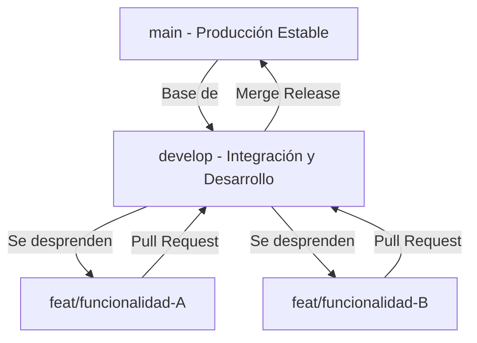

# Flujo de Trabajo en Git y GitHub - Gimnasio SOMA

Este documento describe la estrategia de ramificación (Branching Strategy) que debemos seguir para el desarrollo del proyecto, asegurando que el código en `main` se mantenga estable y que las contribuciones de ambos integrantes se integren de forma ordenada en `develop`.

---

## 📌 1. Esquema de Ramas



*   **`main`**: Rama que contiene el código estable y listo para producción. **Nunca** se debe hacer commit directo sobre esta rama.
*   **`develop`**: Rama base para el desarrollo diario. Aquí se integran todas las nuevas características antes de pasar a producción.
*   **`feat/nombre-funcionalidad`**: Ramas temporales creadas para desarrollar una tarea específica (un endpoint, una vista del front, etc.). Se crean desde `develop` y se vuelven a integrar a ella mediante un Pull Request.

---

## 🚀 2. Flujo de Trabajo Paso a Paso

Para empezar a trabajar en una nueva funcionalidad, sigue estos pasos desde tu terminal:

### Paso 1: Actualizar la rama base
Antes de crear una rama nueva, asegúrate de tener la última versión de `develop` que tu compañero haya subido:
```bash
git checkout develop
git pull
```

### Paso 2: Crear tu rama de funcionalidad
Crea tu rama local con un nombre descriptivo usando el prefijo `feat/`:
```bash
git checkout -b feat/nombre-de-tu-funcionalidad
```
*(Ejemplo: `feat/modelos-database` o `feat/login-profesor`)*

### Paso 3: Trabajar y hacer commits
A medida que realices cambios, ve agregándolos y haciendo commits descriptivos en tu rama local:
```bash
git add .
git commit -m "Explicación breve de lo que agrega o soluciona este commit"
```

### Paso 4: Subir la rama a GitHub
Sube tu rama al repositorio remoto para que esté disponible en la web de GitHub:
```bash
git push -u origin feat/nombre-de-tu-funcionalidad
```

### Paso 5: Abrir un Pull Request (PR)
1. Ve a la página de tu repositorio en GitHub.
2. Verás un cartel flotante que te invita a hacer clic en **"Compare & pull request"**.
3. **[CRÍTICO]** Configura la comparación de la siguiente manera:
    *   **base:** `develop` (hacia dónde van tus cambios)
    *   **compare:** `feat/nombre-de-tu-funcionalidad` (tu rama de trabajo)
4. Agrega una descripción de lo que implementaste y haz clic en **Create pull request**.

### Paso 6: Revisión e Integración
Una vez que el Pull Request sea aprobado por tu compañero, se puede hacer el **Merge** a la rama `develop`. Una vez fusionada la rama en GitHub, puedes borrar la rama del remoto y del local:
```bash
git checkout develop
git pull
git branch -d feat/nombre-de-tu-funcionalidad
```

---

## ⚙️ 3. Configuración Sugerida en GitHub

Para evitar errores humanos, es muy recomendable configurar `develop` como la rama por defecto en la interfaz web de GitHub:

1. Ve a tu repositorio en GitHub.
2. Entra a **Settings** (Configuración) -> **Branches** (Ramas).
3. En la sección **Default branch**, haz clic en el botón de cambiar (flechas cruzadas) y selecciona **`develop`**.
4. Haz clic en **Update**. De ahora en adelante, cada Pull Request que abras sugerirá automáticamente fusionar hacia `develop`.
