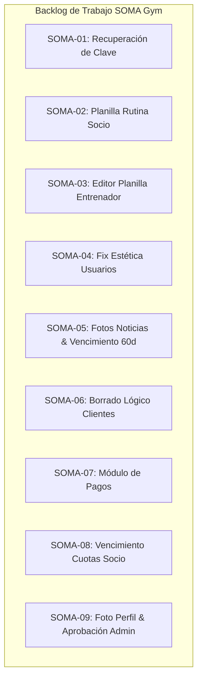

# 📋 SOMA Gym - Backlog y Plan de Trabajo para Desarrollo en Equipo

> **Documento de Planificación de Tareas, Issues y Estrategia de Ramas Git**  
> *Proyecto: Gimnasio SOMA - Sistema de Gestión Híbrida y Fidelización (Prácticas Profesionalizantes III)*  
> *Estrategia de Ramas:* Basada en el flujo oficial definido en [`Documentos/Flujo de GitHub.md`](file:///home/agustin/Practicas%20profesionalizantes%20III/2_%20Zarate,%20Bugnoni%20Agustin-20260824T221128Z-1-001/Soma/Documentos/Flujo%20de%20GitHub.md) (Rama base: `develop`).  
> *Preparado para migración:* Tablero Kanban / Base de Datos en Notion.

---

## 📊 1. Matriz Resumen de Issues y Ramas (Vista Tabla Notion)

| ID Issue | Tarea / Funcionalidad | Rama Git Sugerida | Módulo | Prioridad | Estimación (Story Points) | Estado | Asignado |
| :--- | :--- | :--- | :--- | :---: | :---: | :---: | :---: |
| **SOMA-01** | Recuperación y Reseteo Seguro de Contraseña de Usuarios | `feat/recuperacion-contrasena` | Seguridad / Auth | 🔴 Alta | 5 SP | 📝 Backlog | Equipo |
| **SOMA-02** | Rediseño de Vista de Rutina en Formato "Planilla" (Portal Socio) | `feat/vista-rutina-planilla-socio` | Portal Socio / Rutinas | 🔴 Alta | 5 SP | 📝 Backlog | Equipo |
| **SOMA-03** | Editor y Generador de Rutinas en Formato "Planilla" (Entrenador) | `feat/editor-rutina-planilla-entrenador` | Panel Staff / Rutinas | 🔴 Alta | 8 SP | 📝 Backlog | Equipo |
| **SOMA-04** | Homogeneización Visual y Estética de Pestaña "Personal / Usuarios" | `fix/estetica-tabla-usuarios-admin` | Panel Admin / UI | 🟡 Media | 2 SP | 📝 Backlog | Equipo |
| **SOMA-05** | Soporte de Imágenes en Noticias y Vencimiento Automático (60 días) | `feat/noticias-fotos-vencimiento` | Novedades / Noticias | 🟡 Media | 5 SP | 📝 Backlog | Equipo |
| **SOMA-06** | Borrado Lógico (Soft Delete) y Flujo de Re-alta de Clientes | `feat/clientes-borrado-logico` | Clientes / BD | 🔴 Alta | 5 SP | 📝 Backlog | Equipo |
| **SOMA-07** | Módulo de Pagos y Registro de Cuotas de Gimnasio | `feat/modulo-pagos-administracion` | Finanzas / Pagos | 🔴 Alta | 8 SP | 📝 Backlog | Equipo |
| **SOMA-08** | Indicador de Vencimiento y Adelanto de Cuotas (Portal Socio) | `feat/estado-cuota-portal-socio` | Portal Socio / Cuotas | 🔴 Alta | 5 SP | 📝 Backlog | Equipo |
| **SOMA-09** | Carga de Foto de Perfil y Flujo de Aprobación de Cambios | `feat/foto-perfil-cliente-aprobacion` | Clientes / Perfil | 🟡 Media | 5 SP | 📝 Backlog | Equipo |

---

## 🌳 2. Estrategia de Ramas y Convenciones de Trabajo

De acuerdo al estándar del equipo:
1. Todas las ramas se desprenden desde **`develop`**.
2. **Nomenclatura de ramas:**
   - `feat/nombre-de-la-tarea` para nuevas características.
   - `fix/nombre-del-arreglo` para correcciones de interfaz o bugs.
3. Al finalizar cada tarea:
   - Ejecutar la suite de tests de integración para verificar que nada se haya roto.
   - Realizar `git push -u origin <rama>`.
   - Abrir **Pull Request (PR)** hacia la rama base `develop`.
   - Realizar Code Review entre compañeros antes de mergear.

---

## 📝 3. Detalle Técnico de Tareas e Issues



---

### 🔹 SOMA-01: Recuperación y Reseteo Seguro de Contraseña de Usuarios

* **Rama Git:** `feat/recuperacion-contrasena`
* **Módulo:** Autenticación / Seguridad
* **Prioridad:** 🔴 Alta
* **Historia de Usuario:**  
  *Como usuario o socio del gimnasio, quiero poder recuperar mi contraseña en caso de olvido mediante un enlace o código de recuperación temporal, para poder volver a acceder a mi cuenta sin requerir intervención manual del administrador en la base de datos.*

#### Requerimientos y Necesidades:
1. **Flujo de Solicitud:**
   - En la pantalla de login (`#login-page`), incorporar el enlace "¿Olvidaste tu contraseña?".
   - Modal o vista secundaria que solicita el **Usuario / DNI / Email** registrado.
   - Generación en backend de un token JWT firmado de recuperación con tiempo de expiración corto (ej: 15 minutos) con claim `{"purpose": "password_reset", "sub": usuario_login}` o código OTP de 6 dígitos.
2. **Flujo de Restablecimiento:**
   - Formulario que recibe el token/código, la nueva contraseña y su confirmación.
   - Validación de seguridad (mínimo 6-8 caracteres, combinación alfanumérica).
   - Encriptación con hashing seguro (`SHA-256` o `bcrypt`) y actualización en la tabla `Usuario`.
   - Flag `debe_cambiar_password` se actualiza a `False`.
3. **Endpoints a Implementar:**
   - `POST /api/auth/recuperar-password/solicitar`: Recibe `{"identificador": "..."}`. Genera token de reseteo (simulado en consola/respuesta o enviado por email si hay servidor SMTP).
   - `POST /api/auth/recuperar-password/confirmar`: Recibe `{"token": "...", "nueva_password": "..."}`. Valida el token y actualiza la clave.
4. **Criterios de Aceptación:**
   - [ ] No permite restablecer la contraseña con un token vencido o alterado.
   - [ ] Valida coincidencia entre contraseña nueva y su confirmación.
   - [ ] El usuario puede loguearse inmediatamente con su nueva clave tras el cambio.

---

### 🔹 SOMA-02: Rediseño de Vista de Rutina en Formato "Planilla" (Portal Socio)

* **Rama Git:** `feat/vista-rutina-planilla-socio`
* **Módulo:** Portal Socio / Rutinas
* **Prioridad:** 🔴 Alta
* **Historia de Usuario:**  
  *Como socio del gimnasio, quiero ver mi rutina de entrenamiento en una sola vista en forma de planilla clara y organizada (estilo ficha técnica / tabla deportiva), para poder leer rápidamente mis series, repeticiones, cargas y descansos durante mi entrenamiento sin tener que hacer scroll excesivo en múltiples tarjetas individuales.*

#### Requerimientos y Necesidades:
1. **Rediseño Frontend:**
   - Reemplazar la grilla de tarjetas individuales (`.routine-exercise-card`) por un contenedor unificado de **Planilla de Entrenamiento** (`.routine-sheet-container`).
   - Encabezado de la planilla: Objetivo, Fecha de Inicio, Periodo/Duración, Entrenador asignado y Observaciones generales.
   - Tabla estructurada con columnas:
     - **# / Orden**
     - **Ejercicio** (Nombre + Grupo Muscular destacado con badge)
     - **Series** (ej: `4`)
     - **Repeticiones** (ej: `10-12`)
     - **Carga Sugerida (kg)** (ej: `40.0 kg` o `A criterio`)
     - **Descanso** (ej: `90 seg`)
     - **Indicaciones / Técnica**
2. **Estilos y Usabilidad:**
   - Diseño adaptable a dispositivos móviles (filas compactas con scroll horizontal suave o vista tabular colapsable).
   - Botón de **"Imprimir / Guardar PDF"** con hoja de estilos `@media print` optimizada para llevar al gimnasio en papel.
3. **Criterios de Aceptación:**
   - [ ] Todos los ejercicios de la rutina activa se renderizan en una sola tabla/planilla legible.
   - [ ] La información del entrenador y notas generales se muestran en un bloque superior integrado.
   - [ ] En pantallas móviles y tablets se visualiza de forma ordenada sin desbordamientos rotos.

---

### 🔹 SOMA-03: Editor y Generador de Rutinas en Formato "Planilla" (Entrenador)

* **Rama Git:** `feat/editor-rutina-planilla-entrenador`
* **Módulo:** Panel Staff / Rutinas
* **Prioridad:** 🔴 Alta
* **Historia de Usuario:**  
  *Como entrenador, quiero cargar y modificar la rutina de un cliente en una vista integrada tipo planilla editable (estilo hoja de cálculo con filas dinámicas), para poder diseñar, ajustar cargas y reorganizar ejercicios de manera ágil y visual.*

#### Requerimientos y Necesidades:
1. **Rediseño del Modal / Formulario del Entrenador:**
   - Transformar la pestaña de asignación de rutina (`#tab-rutina`) en una **Planilla Interactiva de Planificación**.
   - Tabla interactiva donde cada fila permite:
     - Selector con autocompletado / buscador rápido del catálogo de ejercicios.
     - Inputs compactos para: Series, Reps, Carga (kg), Descanso.
     - Botón para duplicar fila o eliminar ejercicio.
     - Botones de reordenamiento (Subir / Bajar ejercicio).
   - Botón rápido "+ Agregar Ejercicio a la Planilla" con atajo de teclado (`Enter` o botón destacado).
2. **Backend & Persistencia:**
   - Endpoint `POST /api/clientes/{dni}/rutina`:
     - Recepción del array completo de detalles en una sola transacción atómica (`Session.commit()`).
     - Desactiva automáticamente rutinas anteriores del cliente (`activa = False`) y establece la nueva como vigente.
     - Validación de existencia de todos los `id_ejercicio` enviados.
3. **Criterios de Aceptación:**
   - [ ] El entrenador puede cargar una rutina de 10+ ejercicios en menos de 1 minuto usando la planilla fluida.
   - [ ] Al recargar la ficha del cliente, la planilla carga exactamente los datos guardados.
   - [ ] Si ocurre un error en algún ejercicio, la transacción se revierte (`rollback`) sin dejar datos inconsistentes.

---

### 🔹 SOMA-04: Homogeneización Visual y Estética de Pestaña "Personal / Usuarios" en Admin

* **Rama Git:** `fix/estetica-tabla-usuarios-admin`
* **Módulo:** Panel de Administración / UI & Estilos
* **Prioridad:** 🟡 Media
* **Historia de Usuario:**  
  *Como administrador, quiero que la tabla de gestión de personal y usuarios tenga la misma estética, botones de acción, iconos y efectos visuales que la tabla de socios, para mantener coherencia y profesionalismo en toda la interfaz.*

#### Requerimientos y Necesidades:
1. **Alineación de Clases y DOM:**
   - En `backend/app/static/js/app.js` (`renderUsuarios`):
     - Reemplazar `<button class="btn-action btn-edit">` y `btn-delete` por la estructura estándar del sistema:
       ```html
       <div class="table-actions">
           <button class="btn-icon btn-icon-edit" data-id="${u.id_usuario}" title="Editar Usuario">
               <i class="fa-solid fa-pen-to-square"></i>
           </button>
           <button class="btn-icon btn-icon-delete" data-id="${u.id_usuario}" title="Eliminar Usuario">
               <i class="fa-solid fa-trash"></i>
           </button>
       </div>
       ```
2. **Estilos CSS (`style.css`):**
   - Asegurar que `.table-container`, `table thead`, `table tbody td`, `.badge-role` y los efectos glassmorphism coincidan exactamente entre `#table-clientes` y `#table-usuarios`.
   - Tooltips y animaciones hover idénticas en ambas secciones.
3. **Criterios de Aceptación:**
   - [ ] Los botones de editar y eliminar en la tabla de personal lucen idénticos a los de la tabla de clientes.
   - [ ] No existen saltos visuales ni fuentes desalineadas al cambiar entre pestañas del sidebar.

---

### 🔹 SOMA-05: Soporte de Imágenes en Noticias y Vencimiento Automático (60 días)

* **Rama Git:** `feat/noticias-fotos-vencimiento`
* **Módulo:** Muro de Novedades / Noticias
* **Prioridad:** 🟡 Media
* **Historia de Usuario:**  
  *Como administrador, quiero poder adjuntar una imagen ilustrativa a las publicaciones y que las noticias con más de 60 días de antigüedad se retiren automáticamente del muro, para mantener el portal de novedades fresco, atractivo y relevante para los socios.*

#### Requerimientos y Necesidades:
1. **Modificación en Base de Datos:**
   - Tabla `Noticia`: Agregar columna `imagen_url` (`VARCHAR(255)` / `TEXT`, `NULL`).
   ```sql
   ALTER TABLE Noticia ADD COLUMN imagen_url VARCHAR(255) NULL AFTER categoria;
   ```
2. **Backend & Lógica de Vencimiento:**
   - `POST /api/noticias/`: Soporte para recibir `imagen_url` (o subida multipart con guardado en `static/uploads/noticias/`).
   - `GET /api/noticias/`: Modificar consulta para filtrar automáticamente noticias donde:
     `fecha_publicacion >= CURRENT_DATE - INTERVAL 60 DAY`.
   - Endpoint / Servicio de limpieza opcional: `DELETE /api/noticias/limpiar-vencidas` para purga definitiva de registros antiguos de más de 60 días.
3. **Frontend:**
   - En `#modal-noticia`: Agregar campo para subir archivo de imagen o ingresar URL con vista previa.
   - En las tarjetas del muro (Staff y Socio): Renderizar la imagen con aspect-ratio responsivo (16:9) y efecto de zoom/lightbox al hacer clic.
4. **Criterios de Aceptación:**
   - [ ] Las noticias con imagen se renderizan correctamente en el portal del socio y en el dashboard de staff.
   - [ ] Noticias con fecha de publicación mayor a 60 días atrás no se listan en el muro de socios ni administradores.

---

### 🔹 SOMA-06: Borrado Lógico (Soft Delete) y Flujo de Re-alta de Clientes

* **Rama Git:** `feat/clientes-borrado-logico`
* **Módulo:** Clientes / Base de Datos
* **Prioridad:** 🔴 Alta
* **Historia de Usuario:**  
  *Como administrador, quiero que al dar de baja a un cliente no se destruyan sus registros históricos ni se produzcan conflictos de clave primaria si el cliente vuelve a inscribirse en el futuro, garantizando la trazabilidad de datos y facilitando la re-alta.*

#### Requerimientos y Necesidades:
1. **Modificación en Base de Datos:**
   - Tabla `Cliente`: Agregar columnas `eliminado` (`BOOLEAN DEFAULT FALSE`) y `fecha_baja` (`DATE NULL`).
   ```sql
   ALTER TABLE Cliente ADD COLUMN eliminado BOOLEAN DEFAULT FALSE;
   ALTER TABLE Cliente ADD COLUMN fecha_baja DATE NULL;
   CREATE INDEX idx_cliente_eliminado ON Cliente(eliminado);
   ```
2. **Lógica de Backend (`crud.py` y `routes/cliente.py`):**
   - **Borrado Lógico (`delete_client`):** En lugar de eliminar filas en cascada (`db.delete()`), actualizar:
     - `cliente.eliminado = True`
     - `cliente.activo = False`
     - `cliente.fecha_baja = date.today()`
     - Inhabilitar el acceso de su usuario (`Usuario.rol = 'Inactivo'` o `activo = False`).
     - **Conservar intactos** los registros de `EvolucionFisica`, `RegistroEntrenamiento`, `Rutina`, `Pago` y `Direccion`.
   - **Consulta de Clientes (`get_clients`):**
     - Filtrar por defecto `Cliente.eliminado == False`.
     - Agregar parámetro opcional `?incluir_eliminados=true` para auditoría administrativa.
   - **Flujo de Re-alta (`create_client`):**
     - Si se intenta crear un cliente cuyo DNI ya existe pero tiene `eliminado == True`:
       - Reactivar la ficha (`eliminado = False`, `activo = True`, `fecha_baja = None`).
       - Actualizar los datos de contacto y domicilio con la nueva información enviada.
       - Reactivar la cuenta de usuario asociada.
       - Retornar código HTTP 200/201 con la ficha reactivada sin error de clave primaria duplicada.
3. **Criterios de Aceptación:**
   - [ ] Al eliminar un cliente, desaparece de la vista activa pero sus tablas hijas no sufren borrado físico en cascada.
   - [ ] Al ingresar nuevamente el mismo DNI en "Nuevo Cliente", el sistema recupera el perfil, actualiza los datos y lo reactiva con éxito.

---

### 🔹 SOMA-07: Módulo de Pagos y Registro de Cuotas de Gimnasio

* **Rama Git:** `feat/modulo-pagos-administracion`
* **Módulo:** Administración / Finanzas / Pagos
* **Prioridad:** 🔴 Alta
* **Historia de Usuario:**  
  *Como recepcionista o administrador, quiero registrar de manera ágil los pagos de cuota de los socios (indicando fecha de pago, monto, método y cantidad de meses abonados), para mantener las membresías al día y controlar los ingresos del gimnasio.*

#### Requerimientos y Necesidades:
1. **Ajuste del Modelo de Base de Datos:**
   - Verificar y enriquecer la tabla `Pago` y `Cliente_Membresia`:
   ```sql
   ALTER TABLE Pago ADD COLUMN meses_abonados INT DEFAULT 1;
   ALTER TABLE Pago ADD COLUMN fecha_vencimiento_cuota DATE NULL;
   ```
2. **Lógica de Negocio y Cálculo Acumulativo de Vencimiento:**
   - Si el cliente está al día y su cuota vence el `15/10/2026`, y abona 2 meses el `01/10/2026`:
     - El nuevo vencimiento se calcula sumando 60 días / 2 meses a partir de la fecha de vencimiento previa (`15/12/2026`), no desde el día del pago.
   - Si el cliente estaba vencido, el nuevo vencimiento se calcula a partir de la fecha de pago (`fecha_pago + N * 30 días`).
3. **Endpoints de la API:**
   - `POST /api/pagos/`: Registra el pago (`dni_cliente`, `monto`, `metodo_pago`, `meses_abonados`, `descripcion`) y actualiza la vigencia en `Cliente_Membresia`.
   - `GET /api/pagos/cliente/{dni}`: Retorna el historial cronológico de pagos del socio.
   - `GET /api/pagos/resumen-mensual`: Métricas para el administrador (total recaudado en el mes, cantidad de cuotas cobradas).
4. **Frontend Staff:**
   - Pestaña o modal de "Registrar Cobro / Pago" en la ficha del cliente con cálculo automático del nuevo vencimiento.
   - Tabla de historial de pagos dentro de la ficha del socio.
5. **Criterios de Aceptación:**
   - [ ] Registrar un pago de 1 mes extiende la membresía 30 días.
   - [ ] Registrar un pago múltiple (ej. 3 o 6 meses) extiende proporcionalmente la fecha de vencimiento.
   - [ ] Queda registrado el historial inmutable de cada transacción con fecha, monto y medio de pago.

---

### 🔹 SOMA-08: Indicador de Vencimiento y Adelanto de Cuotas (Portal Socio)

* **Rama Git:** `feat/estado-cuota-portal-socio`
* **Módulo:** Portal Socio / Membresía
* **Prioridad:** 🔴 Alta
* **Historia de Usuario:**  
  *Como socio del gimnasio, quiero ver de forma clara en mi portal cuándo vence mi cuota y cuántos días o meses tengo cubiertos (incluso si pagué meses por adelantado), para estar informado sobre el estado de mi suscripción.*

#### Requerimientos y Necesidades:
1. **Lógica de Backend:**
   - Endpoint `GET /api/clientes/{dni}/estado-cuota`:
     - Retorna:
       - `fecha_vencimiento`: Fecha límite de la cuota activa.
       - `dias_restantes`: Días de vigencia restantes.
       - `estado`: `"Al día"`, `"Vence pronto"` (menos de 5 días), o `"Vencida"`.
       - `meses_adelantados`: Cantidad de meses cubiertos a futuro.
       - `ultimo_pago`: Objeto con fecha, monto y concepto del último abono registrado.
2. **Frontend Portal Socio:**
   - En el Navbar y Dashboard del Socio (`#portal-socio-page`):
     - Widget / Card de estado de suscripción con semáforo visual:
       - 🟢 **Verde:** "Cuota al día - Vence el 15/12/2026 (quedan 45 días)".
       - 🟡 **Amarillo:** "Tu cuota vence en 3 días (el 04/09/2026)".
       - 🔴 **Rojo:** "Cuota vencida desde el 28/08/2026 - Regulariza en recepción".
     - Badge informativo si el socio cuenta con meses prepagados por adelantado.
3. **Criterios de Aceptación:**
   - [ ] El socio ve inmediatamente al ingresar el estado de su cuota y la fecha exacta de vencimiento.
   - [ ] Si pagó 3 meses por adelantado, el portal refleja el vencimiento extendido a 3 meses.

---

### 🔹 SOMA-09: Carga de Foto de Perfil y Flujo de Aprobación de Cambios

* **Rama Git:** `feat/foto-perfil-cliente-aprobacion`
* **Módulo:** Clientes / Perfil / Recepción
* **Prioridad:** 🟡 Media
* **Historia de Usuario:**  
  *Como recepcionista/admin quiero cargar la foto del socio al crear su perfil; y como socio quiero poder enviar una foto nueva desde mi portal para que el staff la apruebe y actualice mi avatar oficial.*

#### Requerimientos y Necesidades:
1. **Modificación en Base de Datos:**
   - Tabla `Cliente`: Agregar `foto_url` (`VARCHAR(255)` / `TEXT`, `NULL`).
   - Nueva Tabla `Solicitud_Foto_Perfil`:
   ```sql
   CREATE TABLE Solicitud_Foto_Perfil (
       id_solicitud INT AUTO_INCREMENT PRIMARY KEY,
       dni_cliente VARCHAR(20) NOT NULL,
       foto_propuesta_url VARCHAR(255) NOT NULL,
       fecha_solicitud DATETIME DEFAULT CURRENT_TIMESTAMP,
       estado ENUM('Pendiente', 'Aprobada', 'Rechazada') DEFAULT 'Pendiente',
       motivo_rechazo VARCHAR(255) NULL,
       id_usuario_revisor INT NULL,
       fecha_resolucion DATETIME NULL,
       FOREIGN KEY (dni_cliente) REFERENCES Cliente(dni) ON DELETE CASCADE,
       FOREIGN KEY (id_usuario_revisor) REFERENCES Usuario(id_usuario)
   );
   ```
2. **Lógica de Backend:**
   - `POST /api/clientes/{dni}/foto`: Admin/Recepción actualiza directamente la foto del socio (en alta o edición presencial).
   - `POST /api/clientes/{dni}/solicitar-cambio-foto`: El socio envía una nueva foto (`estado = 'Pendiente'`).
   - `GET /api/solicitudes-foto/`: Staff consulta solicitudes pendientes.
   - `POST /api/solicitudes-foto/{id}/aprobar`: Staff aprueba la foto -> actualiza `Cliente.foto_url` y marca la solicitud como `'Aprobada'`.
   - `POST /api/solicitudes-foto/{id}/rechazar`: Staff rechaza con motivo -> marca `'Rechazada'`.
3. **Frontend:**
   - **Portal Socio:** Modal "Actualizar Foto de Perfil" con vista previa y mensaje de estado "Foto enviada a recepción para validación".
   - **Dashboard Admin:** Notificación / panel con fotos pendientes para aprobar o rechazar con 1 clic.
4. **Criterios de Aceptación:**
   - [ ] El socio no puede modificar directamente su foto en producción sin pasar por la aprobación del staff.
   - [ ] Al aprobar la solicitud, el avatar del socio se actualiza automáticamente en toda la aplicación.

---

## 🧪 4. Especificación y Matriz de Pruebas de Integración

Para validar la correcta implementación de cada tarea sin depender de una base de datos MySQL externa durante el desarrollo continuo, se provee el archivo de pruebas de integración automatizado:
👉 [`backend/tests/test_integration_backlog.py`](file:///home/agustin/Practicas%20profesionalizantes%20III/2_%20Zarate,%20Bugnoni%20Agustin-20260824T221128Z-1-001/Soma/backend/tests/test_integration_backlog.py)

| Test Unitario / Integración | Tarea Asociada | Objetivo de la Validación |
| :--- | :--- | :--- |
| `test_tarea_01_recuperacion_contrasena_flujo_completo` | **SOMA-01** | Emisión de token de reseteo, rechazo de tokens inválidos y actualización efectiva de clave. |
| `test_tarea_02_vista_rutina_planilla_socio` | **SOMA-02** | Consulta de rutina activa con estructura tabular, metadatos de ejercicios y observaciones. |
| `test_tarea_03_generador_rutina_planilla_entrenador` | **SOMA-03** | Asignación en lote de múltiples ejercicios en planilla, desactivación de rutina previa y atomicidad. |
| `test_tarea_04_estetica_y_consistencia_usuarios_admin` | **SOMA-04** | Integridad del CRUD de personal, validación de unicidad de login y contrato de datos. |
| `test_tarea_05_noticias_subida_foto_y_vencimiento_60_dias` | **SOMA-05** | Publicación con `imagen_url` y filtrado estricto de noticias con más de 60 días de antigüedad. |
| `test_tarea_06_clientes_borrado_logico_y_realta` | **SOMA-06** | Marcado de baja con `eliminado=True` sin borrar historial, y re-alta exitosa del mismo DNI. |
| `test_tarea_07_modulo_pagos_extension_cuota_multimes` | **SOMA-07** | Registro de cobros simples y adelantos de múltiples meses con cálculo acumulativo. |
| `test_tarea_08_portal_socio_indicador_estado_cuota` | **SOMA-08** | Verificación del semáforo de vencimiento, días restantes y cuotas adelantadas en el portal. |
| `test_tarea_09_foto_perfil_cliente_flujo_aprobacion` | **SOMA-09** | Carga directa por admin, envío de solicitud por el socio y aprobación por el staff. |

### 🚀 Cómo ejecutar las pruebas de integración:

Las pruebas están diseñadas para ejecutarse de forma aislada e independiente mediante una base de datos SQLite en memoria, por lo que **no requieren que MySQL esté encendido** para validar la lógica de las ramas.

#### 1. Activar el entorno virtual de Python:
* **Linux / macOS:**
  ```bash
  cd backend
  source .venv/bin/activate
  ```
* **Windows (PowerShell / CMD):**
  ```powershell
  cd backend
  .venv\Scripts\activate
  ```

#### 2. Ejecutar toda la suite de pruebas del backlog:
```bash
pytest tests/test_integration_backlog.py -v
```
*(o alternativamente con `python -m pytest tests/test_integration_backlog.py -v`)*

#### 3. Ejecutar una prueba específica por número de tarea / issue:
```bash
# Ejemplo: Probar solo la Tarea SOMA-01 (Recuperación de contraseña)
pytest tests/test_integration_backlog.py -k "test_tarea_01" -v

# Ejemplo: Probar solo la Tarea SOMA-06 (Borrado Lógico y Re-alta)
pytest tests/test_integration_backlog.py -k "test_tarea_06" -v

# Ejemplo: Probar solo las Tareas SOMA-07 y SOMA-08 (Módulo de Pagos y Cuotas)
pytest tests/test_integration_backlog.py -k "test_tarea_07_y_08" -v
```

